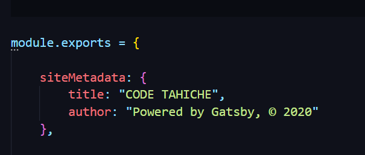
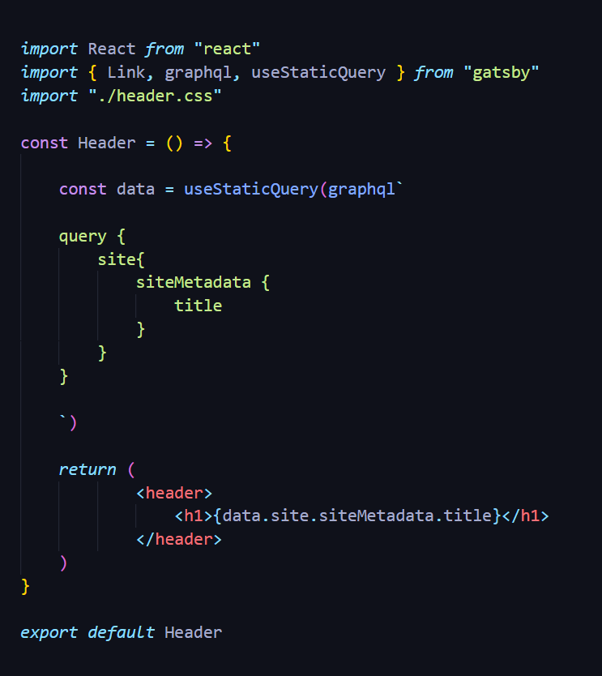
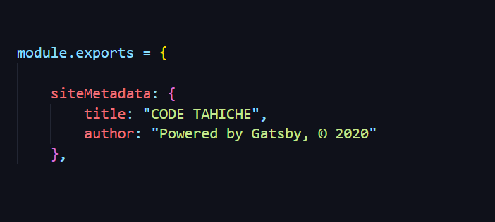
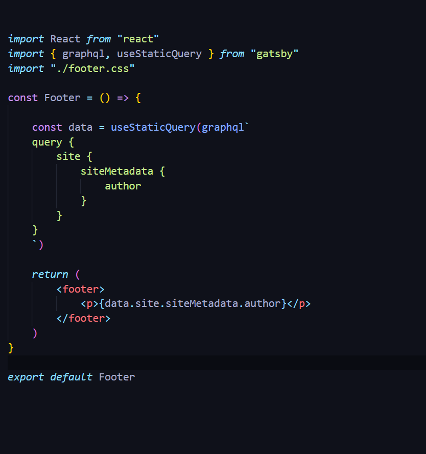

1. Configuration du fichier `gatsby-config.sys`

Pour afficher le titre de votre site de façon dynamique et ainsi augmenter vos performances SEO, il faut d'abord modifier le fichier gatsby-config.sys. C'est à partir de ce fichier que seront lues les données. 

Placez de préférence votre module.exports au début de votre fichier gatsby.config.sys. Enlevez la vurgule à la fin s'il n'y a aucune ligne de code ensuite. C'est dans ce même fichier que vous listerez vos plugins si ce n'est pas déjà le cas.

2. Création d'un component React : 

Il s'agira sans doute de votre Header. Le component à créer sera donc "header.js" et vous pourrez importer vos styles CSS. Il vous faudra aussi importer graphql et useStaticQuery pour utiliser vos données. (Il s'agit d'exemples sans utiliser SAAS ni modules CSS, uniquement pour des raisons de simplicité)

Entre les balises `<h1>` vous pouvez noter le code javascript à utiliser pour remplacer votre ancien titre.
 

Vous pouvez suivre la même procédure pour le copyright, la description de votre site, etc ...

