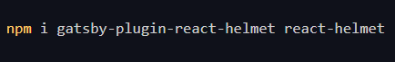
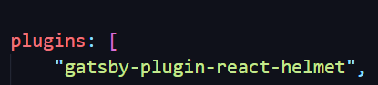
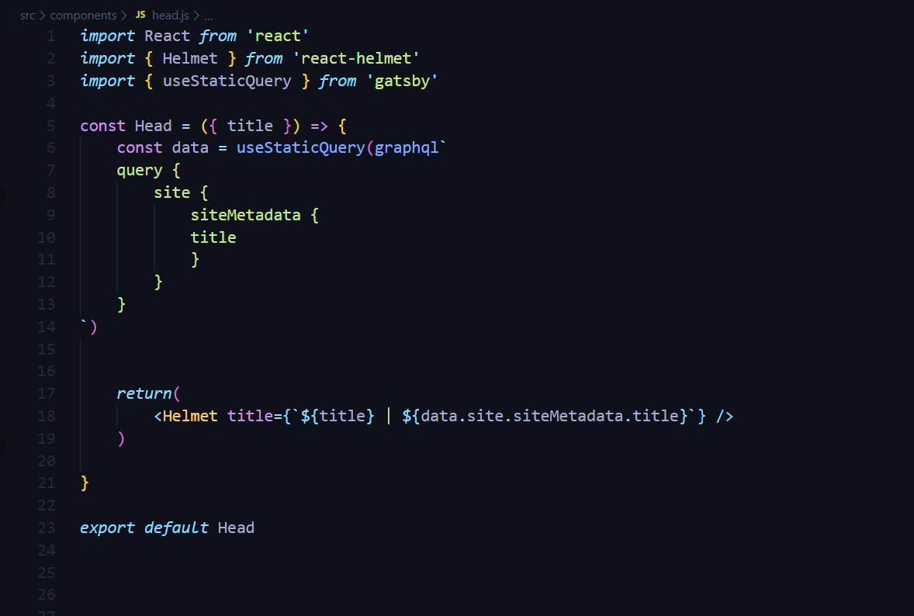
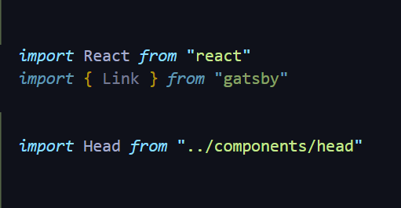
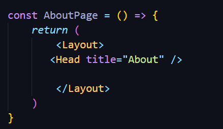

Bien configurer les onglets permet d'améliorer considérablement votre référencement.Voici la marche à suivre:

1. Installer deux plugins gatsby.

2. Configurer le fichier gatsby-config.sys.

3. Création du composant head.js.

4. Importer votre composant dans chacune des pages de votre projet.

5. Ajouter l'élément Head.

  

1. Installer deux plugins gatsby.

Il faut installer le plugin gatsby-react-helmet ainsi que le plugin react-helmet par la commande suivante:

 

2. Configurer le fichier gatsby-config.sys:

Ajouter la ligne "gatsby-plugin-react-helmet" en haut de votre liste de plugins (sans oublier la virgule à la fin de la ligne!). 

3. Création du composant head.js:

4. Importer votre composant dans chacune des pages de votre projet:

Evidemment, votre import pourra varier selon l'arborescence des répertoires que vous avez choisie.

5. Ajouter l'élément `<Head />` pour chaque page et pour votre template le cas échéant:

Pour les pages: 
ajouter l'élément ` <Head title="nom de votre page"> `  juste en desous de l'élément ` <Layout> `

Pour les templates: 
toujours sous l'élément `<Layout>` , il faut ajouter :

`<Head title={props.data.markdownRemark.frontmatter.title} />`

De cette façon, l'onglet de chaque post ouvert par l'utilisateur affichera automatiquement le titre du post en question.

